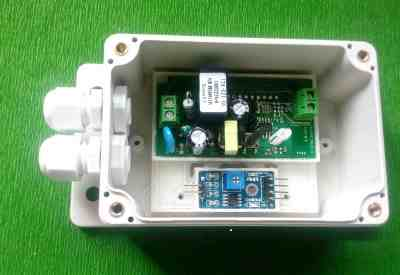

# e3DHW-make-DIY-electronics-hardware-like-a-professional
 
The evolution of the electronics from the single components to the macro-sets (boards and shields)
was positive, allowing the rapid prototyping of complex projects until a few years ago
unimaginable, thus bringing new audiences of enthusiasts to electronics.

I want to present some ideas to move from an electronic 'prototype' to a more stable and usable
realization, in a simple, quick and economical way.
With the use of a 3D printer and a series of OpenSCAD (https://www.openscad.org/) parametric libraries ready to use.

The use of the 3D printer allows to obtain tailor-made structures without the need of mechanical
workshop machines for cutting, bending or drilling. Also many accessories (ADDONs) such as
terminals, connectors etc. can be inserted into the 3D project by simplifying assembly and wiring.

 

- For the full story, read the e3DHW_HOWTO_en.pdf file (versione italiana e3DHW_HOWTO_it.pdf)
- OpenScad libraries, last version, in dir OpenScadLibraries :)
- File help for all libraries: e3DHWref.1.2.chm.
- Also here: https://www.thingiverse.com/thing:2860353
